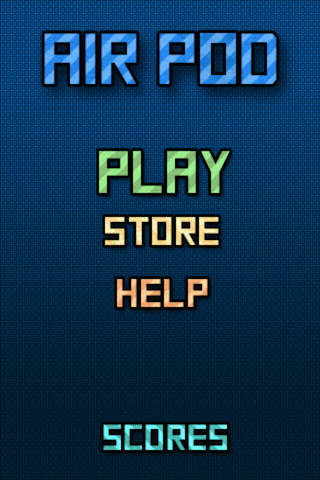
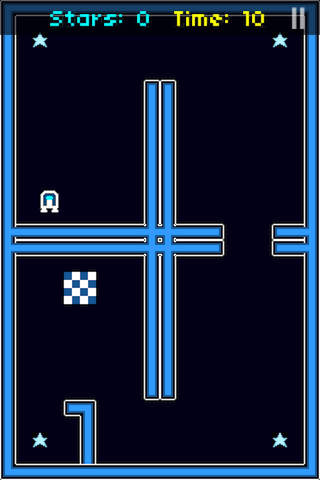
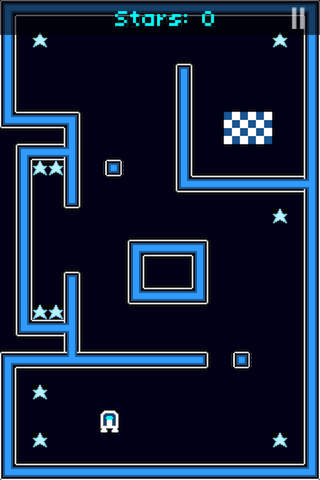

Air Pod
=======

I developed this iOS game using Objective-C and the the Sparrow Framework.

The design and inspiration for the game were from an Game Maker/Flash game by Alexitron; I adapted it for mobile and added new features.

It reads map files through a simple CSV format that can be exported by the Tiled application. Maps are read in Map.m.

To play the game, users fly an "Air Pod" around a maze, tapping to thrust the Air Pod upwards and tilting their device to steer. 

This is only the sourcecode portion, and will need to be established in a proper Xcode project with the Sparrow framework and artwork/assets included.

Screenshots
----------- 

